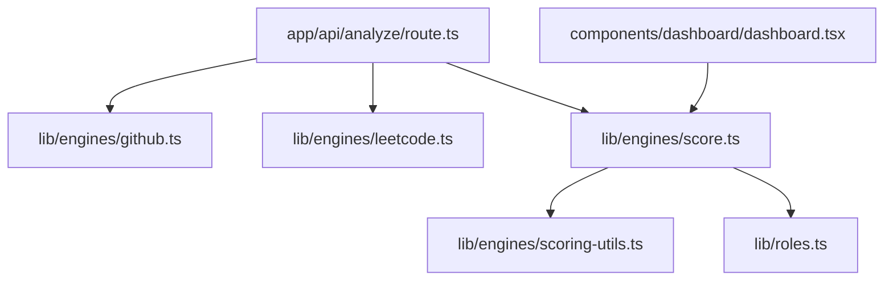

# getMost: Developer Profile & Readiness Analyzer

getMost evaluates software engineering candidates by analyzing their public contributions on GitHub and LeetCode. The tool calibrates repository activity, language familiarity, coding consistency, and algorithmic skills against configurable baselines for various engineering roles. It generates a diagnostic dashboard and a structured skill development roadmap using LLM analysis.

## Key Features

* **Multi Platform Metric Extraction:** Pulls repository structures, language distributions, and commit frequency from GitHub, and queries problem-solving volume, difficulty distribution, and contest history from LeetCode.
* **Role and Seniority Baselines:** Compares candidate profiles to configurable target baselines across 7 roles (Frontend, Backend, Full-Stack, DevOps, Data, ML, and Mobile) and 4 seniority levels (Intern to Senior).
* **Four Pillar Scoring Model:** Normalizes and scores performance across Code Quality & Projects, Algorithmic Problem Solving, Commit Consistency, and Public Impact.
* **Automated Feedback & Roadmap:** Uses LLM analysis via Groq (`llama-3.3-70b-versatile`) to generate a concrete breakdown of strengths, gaps against baselines, and actionable target suggestions (e.g., specific algorithms or test coverage practices).
* **Interactive Visualization:** Visualizes scores relative to target baselines using a comparative radar chart, overall readiness indicators, and detailed pillar breakdowns.

## Scoring Pillars and Math Models

The scoring logic (located in [score.ts](lib/engines/score.ts)) uses mathematical utilities from [scoring-utils.ts](lib/engines/scoring-utils.ts) to handle real-world developer data:

### Code & Projects
* **Target:** Code relevance, repository structure, documentation quality, and test coverage.
* **Logic:** Uses an S-curve growth model (`diminishingReturns`) to score total repositories against the role's baseline, and weights this against original work ratio, documentation scores, and testing density.
* **Source:** [score.ts (codeScore)](lib/engines/score.ts#L66)

### Problem Solving
* **Target:** Algorithmic aptitude.
* **Logic:** Scales LeetCode volume relative to target baseline, weights the difficulty distribution (Medium/Hard ratio), adjusts for depth balance (to discount users who only solve Easy problems), and factors in contest rating thresholds.
* **Source:** [score.ts (dsaScore)](lib/engines/score.ts#L110)

### Consistency & Activity
* **Target:** Continuous contribution habits.
* **Logic:** Applies an exponential decay curve (`recencyCurve`) to the time since the user's last push (halving score potential as inactivity stretches past 45 days) combined with active repository counts over 90-day and 365-day windows.
* **Source:** [score.ts (consistencyScore)](lib/engines/score.ts#L186)

### Impact & Reach
* **Target:** Collaboration and open source contributions.
* **Logic:** Compresses total stars, followers, and forks using a base-2 logarithmic scale (`logarithmicScale`) to prevent outlier from skewing the results, and adds tiered bonuses for popular repositories.
* **Source:** [score.ts (impactScore)](lib/engines/score.ts#L226)

## Dynamic Weighting and Profile Constraints

If a candidate only provides one profile (GitHub or LeetCode):
* The engine dynamically redistributes metric weights to focus entirely on the available platform.
* The overall score is capped at 75/100 to account for the missing data source.
* When both profiles are provided, a synergy bonus (up to +5 points) is awarded if the candidate exceeds target thresholds in both project-based coding and algorithmic problem solving.

## Codebase Architecture

* **[app/api/analyze/route.ts](app/api/analyze/route.ts):** Orchestrates data collection from APIs, triggers scoring, runs LLM analysis, and returns the unified report schema.
* **[lib/engines/github.ts](lib/engines/github.ts):** Queries public GitHub user endpoints, handles language byte-weight aggregation, checks documentation readmes, and counts test references.
* **[lib/engines/leetcode.ts](lib/engines/leetcode.ts):** Makes POST requests to LeetCode's GraphQL API to extract solved problem difficulty breakdown, submission volume, and contest rankings.
* **[lib/engines/score.ts](lib/engines/score.ts):** Calculates metric pillars, resolves dynamic weight redistribution, and maps language and topic relevance profiles against target definitions.
* **[lib/roles.ts](lib/roles.ts):** Configures baseline settings, core/secondary language maps, topic keywords, and pillar weights across seniority targets.
* **[components/dashboard/dashboard.tsx](components/dashboard/dashboard.tsx):** React dashboard displaying the analysis, custom radar chart, score status tags, and LLM-generated roadmap.

## Tech Stack

* **Core Framework:** Next.js (App Router) & React
* **State Management:** Redux Toolkit & React Redux
* **Styling & UI:** Tailwind CSS, Base UI, Lucide React icons
* **Data Visualization:** Recharts (for radar performance charts)
* **AI Pipeline:** Vercel AI SDK & Groq API (`llama-3.3-70b-versatile`) with Zod for structured output validation
* **Testing:** Vitest
* **External Integration:** GitHub REST API (custom repository analysis) & LeetCode GraphQL API (stats fetcher)

## Contributing & Support

If you would like to help improve getMost, contributions are always welcome! Feel free to open a pull request or start a discussion. If you find the tool useful, supporting the project with a star is highly appreciated.
